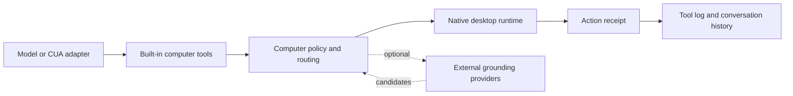

# TouchAI Computer Use Architecture

This document records the implementation boundary for issue #111.

## Goals

TouchAI computer use is a native desktop control layer, not a bundled research agent stack.
The core contract should stay stable while the execution backend can evolve from lightweight
Windows primitives to richer external providers.

The first complete version should provide:

- a stable model-facing tool surface for session setup, observation, and action execution
- tree-first observation on native Windows surfaces, with screenshot fallback metadata
- auditable action receipts for every desktop side effect
- explicit background-safety semantics
- cross-platform capability reporting instead of silent failure
- adapter seams for Cua, OmniParser, UI-TARS, browser automation, or other future providers

## Product Research Summary

The reviewed projects converge on the same shape: observe, plan one bounded action, execute
through a controlled gateway, then observe again.

- [trycua/cua](https://github.com/trycua/cua) is valuable as a mature sandbox/driver stack,
  but bundling it would add Python, VM/sandbox management, and image/runtime weight that do
  not fit TouchAI's desktop package by default.
- [CursorTouch/Windows-MCP](https://github.com/CursorTouch/Windows-MCP) and
  [CursorTouch/Windows-Use](https://github.com/CursorTouch/Windows-Use) are the closest
  design references for Windows: use UI Automation or accessibility trees first, keep vision
  optional, and expose schema-shaped actions rather than raw input injection.
- [browser-use](https://github.com/browser-use/browser-use) is mature for browser workflows,
  but it should remain a browser adapter, not the desktop automation core.
- [Microsoft OmniParser](https://github.com/microsoft/OmniParser) and UI-TARS style agents
  improve screenshot grounding, but they are too heavy to embed silently and do not replace
  native execution policy.
- [Anthropic computer use](https://docs.anthropic.com/en/docs/agents-and-tools/computer-use)
  and [OpenAI computer use](https://platform.openai.com/docs/guides/tools-computer-use)
  define useful provider loops, but both expect the application to own the execution
  environment and safety gateway.

## Architecture

TouchAI owns the gateway. Model providers and external CUA stacks may propose actions, but
TouchAI resolves, validates, executes, and records them.

### Layer 1: Model-Facing Tools

The model sees three built-in tools:

- `builtin__computer_session`: declare target scope and requested capabilities.
- `builtin__computer_observe`: return a tree-first desktop observation with window, display,
  element, and optional screenshot metadata.
- `builtin__computer_act`: execute one bounded action and return an auditable receipt.

The tool names and input schemas are provider-neutral so OpenAI computer-use models,
Anthropic computer-use models, ordinary vision-language models, and future CUA adapters can
share the same gateway.

### Layer 2: Policy and Routing

Policy normalizes target references and selects an execution route:

- `native_tree`: native element/window references from Windows UI surfaces.
- `vision_fallback`: coordinate targets from screenshots or external grounding.
- `browser_dom`: reserved for browser adapters.
- `external_provider`: reserved for Cua, OmniParser, UI-TARS, or similar systems.

Routes are explicit:

- `win32.send_input`: foreground pointer and keyboard execution.
- `win32.message`: background-safe native window messaging when a native target exists.
- `screen.capture`: observation-only screenshot path.
- `unsupported`: capability is unavailable on the current platform or target.

Every action receipt includes `route`, `lane`, `backgroundSafe`, `cursorMoved`,
`foregroundChanged`, `targetResolved`, `status`, and warnings.

### Layer 3: Native Runtime

The native runtime is intentionally lightweight:

- enumerate display and focused-window metadata
- expose capability snapshots per platform
- serialize mutating desktop actions
- reject unsafe background coordinate actions
- return structured unsupported errors on platforms without an implementation

Windows is the primary runtime. macOS and Linux must report capabilities clearly before richer
adapters are implemented.

### Layer 4: External Providers

External providers are optional adapters, not bundled dependencies.

Future adapters may provide:

- screenshot-to-element candidates
- click prediction for ordinary VLMs
- browser DOM observations
- VM or sandbox execution through Cua-like drivers

Adapters must return normalized observations or target candidates. They must not bypass
TouchAI action policy, logs, or receipts.

## Safety Defaults

- Computer tools are seeded disabled by default.
- `computer_act` is limited to one successful action per model tool round.
- Background execution is allowed only when the target is a native element or window route.
- Coordinate-only targets are foreground-only because they cannot be background-safe.
- Text and keyboard operations require an explicit `value`.
- Unsupported platforms and routes return structured errors instead of best-effort input.

## Non-Goals

This implementation does not bundle:

- Cua sandbox or VM images
- Python automation runtimes
- local OmniParser or UI-TARS model weights
- a provider/model selector UI
- autonomous long-running desktop loops

Those capabilities remain adapter-level extensions over the same tool contract.
