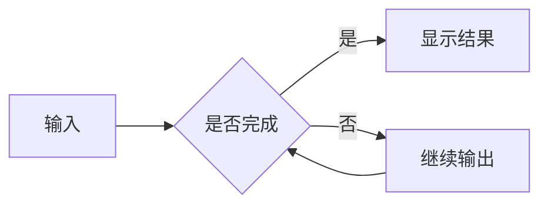

# 前端依赖升级：人工验收测试用例表

更新时间：2026-10-07。范围：`chore/frontend-dependency-upgrade-main` worktree；依赖保持升级，不以降级恢复外观。

## 0. 开始前先看

- **这是待执行的验收表，不是通过报告。** 结果栏填写“通过 / 失败 / 阻塞 / 不适用”，失败附截图或录像；不要默认打勾。
- **当前测试 exe 已包含本轮流式公式源码修复。** 已使用最终锁文件完成 Tauri debug/no-bundle 构建；M01、M02 可在下面记录的测试版上执行。
- **代码块收起留白尚未关闭。** 开发侧在真实历史会话及 WebView2 模拟流式中未复现；C01、C05 保留为开放项，不应理解成已经修好、只等 maintainer 确认。
- 当前测试版是 E2E 隔离模式，不能判定正常模式的全局快捷键、托盘、通知、MCP 自动连接或真实字体初始化通过。D01～D03 必须另用正常模式的隔离测试数据执行，不能操作安装版数据。
- 已完成完整 Tauri debug/no-bundle 构建，构建输出使用 `D:\\TouchAI-build\\dependency-upgrade-origin-main\\target`；该产物不是 release 安装包。
- 模型输出有随机性。若没有按提示生成指定的代码块/公式，这是“样本未准备好”，先补齐样本再测；不要把模型写错公式或遗漏内容直接记成渲染失败。真实请求可能计费，建议先复用已有会话。
- 只在测试版、worktree 的测试数据中执行；不删正式会话，不改正式密钥，不运行生成的代码。工具测试只允许只读操作。
- 旧版视觉对照：两边使用相同窗口尺寸、Windows 缩放、主题和同一份原始回答；通过旧版已有历史或复制文本对照，不能让两次模型随机回答充当同一基准。

### 本次执行记录

| 项目 | 填写 |
| --- | --- |
| 测试日期、人员 | |
|  exe 绝对路径、修改时间、构建标识  | `D:\\TouchAI-build\\dependency-upgrade-origin-main\\target\\debug\\TouchAI.exe`；2026-10-07 18:06:36；debug/no-bundle |
| 是否已包含本轮公式源码修复 | 是 |
| 正常模式 / E2E 模式、数据目录 | |
| Windows 缩放、窗口尺寸、主题 | |
| provider、模型；是否支持工具/推理 | |
| 旧版对照产物或截图 | |

建议顺序：**P0 → P1 → P2**。先发提示词 A，可复用同一回答做 C01～C04、C06；再用 B 测公式，用 C 测富文本，用 D 测输出中交互。缺少条件时写“阻塞/不适用＋原因”，不能写通过。

## 1. P0：本次升级必须验收

| 编号 | 区域 / 样本 | 操作步骤 | 预期结果（全部满足才通过） | 结果 / 证据 |
| --- | --- | --- | --- | --- |
| V01 | 原版视觉；A、C 或相同历史 | 相同宽度并排看正文、代码、设置页；再缩窄窗口；对照浅色主题，若支持主题切换再复测 | 保持 TouchAI 旧版字体、暖色背景、密度、缩进、圆角和工具栏；不变成第三方默认皮肤，不裁掉按钮；不要求抗锯齿逐像素相同 | 待测 |
| C01 | 完成后的折叠；A / 原问题会话 | 等代码高亮完成；滚到长块中间，点击收起；滚动整条消息；再展开，连续 3 次；短块也测一次 | 只留下标题/工具栏，代码和内部滚动条隐藏，下面内容上移；不能残留原代码高度的空白；展开后内容完整且可滚动。**原问题未关闭** | 待测 |
| C02 | 不软换行；A | 将窗口缩窄；看含 LONG_LINE_END 的长行；拖横向条到底；再加宽 | 长代码行始终是一行，通过横滚看到 LONG_LINE_END；原本换行、空行和缩进保留；整页不被撑宽；普通正文仍自动换行 | 待测 |
| C03 | 自定义横/纵滚动条；A | 悬停、拖动长行横条；长块纵向拖到底，再滚回顶部；流式阶段也观察 | TouchAI 细滚动条（设计宽度 6 CSS px，随系统缩放显示）、圆角滑块、无两端箭头；能到右端和 ROW_100；没有第二套粗系统条或被遮挡的角落 | 待测 |
| C04 | 完整复制；A | 分别复制两个代码块，粘贴到系统记事本/编辑器；编辑器关闭自动换行；比对首尾、空行、缩进和长行 | 只复制选中块；无行号、按钮文字、相邻正文和另一块；有 ROW_001、ROW_100、LONG_LINE_END 和 COPY_OK；原始换行、中文、引号和缩进正确；不执行代码 | 待测 |
| C05 | 输出中收起；D | 代码仍在增加时收起；继续观察 5 秒；展开，再收起并等回答结束；另一次在刚出现首行时立即收起 | 新内容不能把已收起的代码重新撑开；final 切换不留下大块空白；展开可看到后来追加的行；复制无重复/丢行。**原问题未关闭** | 待测 |
| C06 | 多块独立；A | 先收起第一块，观察第二块；复制第二块；展开第一块；再反过来 | 每个块的折叠、滚动和复制状态不串块；第二块不消失，首块恢复不破坏正文 | 待测 |
| M01 | 公式流式边界；B | 从输出开始观察并录像；重点看每个公式闭合后出现的下一标题；回答结束后再对比 | 未完成语法可暂显源码/占位；闭合后不把“示例2/3/4”当公式，不把后续正文卷入公式；输出结束前已完成的公式可正常显示；final 前后不突然改写已完成段落 | 阻塞：待含修复的新构建 |
| M02 | 公式与代码混排；B | 完成后检查 4 个独立公式、行内公式和末尾 sh 块；收起/展开代码；切换会话再回来 | 公式和标题数量正确；行内代码 `$$` 不开启公式；shell 的 $HOME、$PATH 保持原文；代码仍不软换行，公式前后文字不丢失 | 阻塞：待含修复的新构建 |
| S01 | 停止 / 再生成；D | 另开测试会话；输出未结束时按停止，等待数秒；继续发送短问题，再用已有的重新生成/重试入口 | 停止后不再追加旧请求内容，按钮恢复；保留已到达文字，不永久 loading；下一请求可用；重试不混入旧文本。停止恰逢未闭合公式/代码可显示未完成内容，但不能破坏整条布局 | 待测 |
| S02 | 历史恢复；A、B | 记下会话标题；切换另一会话再返回；退出并重开测试版，再打开同一历史 | 原始内容、代码复制和公式仍正确；无永久加载或重复消息；恢复后再次折叠无留白。不要求折叠状态持久化，除非旧版原本支持 | 待测 |
| I01 | 中文 IME，不需发送 | 输入拼音，在候选状态按 Enter 选词；再输入中文标点/emoji；用鼠标换选区 | 选词 Enter 只完成输入法组合，不误发送；无重字/吞字、光标乱跳；选区正确 | 待测 |
| I02 | 多行粘贴 / 撤销，不需发送 | 粘贴 F 的三行；光标中间 Shift+Enter；选第三行替换；Ctrl+Z，再 Ctrl+Y（按现有快捷键） | 三行和空行保留，Shift+Enter 不发送；撤销/重做结果一致，光标和选区正常；没有意外合并整段 | 待测 |
| I03 | 发送键规则；F | 记下当前发送键设置；在非 IME 组合状态验证该设置对应的发送键与换行键；发送 F，收到回复后继续输入 | 按既有配置发送，不擅自变更习惯；换行键不发送；发送只一次，输入框可继续使用；若改设置，测试后恢复 | 待测 |

## 2. P1：相关依赖能力回归

| 编号 | 区域 / 样本 | 操作步骤 | 预期结果 | 结果 / 证据 |
| --- | --- | --- | --- | --- |
| R01 | Markdown 基础；C | 看标题、粗体、删除线、引用、列表、行内代码和表格；缩窄窗口 | 块间距接近旧版；表格列对齐，不撑坏整页；正文正常换行；代码的禁止软换行不误伤正文 | 待测 |
| R02 | Mermaid；C | 等图表源输出完；使用原本已有的源码/图表切换或预览入口（若有）；关闭再打开 | 语法有效时可显示图；输出不完整时可暂显源码/占位，完整后恢复；不永久 loading、遮挡后续内容或出现新按钮样式突变 | 待测 |
| R03 | 链接；C | 点击示例链接并观察外部浏览器；返回 TouchAI；用键盘聚焦链接 | 通过原有安全入口打开正确页面，主窗口不被导航走；返回后焦点/滚动正常；不访问真实账号或敏感链接 | 待测 |
| R04 | HTML/SVG；G | 先看代码块原文；仅在旧版已有且允许的入口打开预览；关闭，重新展开和复制 | fenced 内容不会自动执行；静态预览若支持应正常；关闭后主窗口正常；无预览能力标“不适用”，不能新增/放宽执行权限来通过测试 | 待测 |
| U01 | 设置、下拉、对话框 | 打开设置并逐页切换；展开模型/语言下拉；Tab/Shift+Tab；Esc；点击外部；打开已有确认对话框后取消 | 无空白页、弹层偏位/截断；关闭符合原规则；焦点回到触发控件或合理位置，不键盘锁死，不误提交设置 | 待测 |
| U02 | 中英文界面 | 测试数据内切换中/英文；打开同一代码会话、菜单和弹层；恢复原语言 | 按钮/提示按语言更新，不显示翻译 key；切换不让代码永久 loading、丢内容或卡住收起按钮 | 待测 |
| A01 | 常用 provider；B 或 F | 每个实际使用的 provider 各发一次；支持推理的模型另观察推理区展开/收起 | 文本逐步到达，结束状态正确；推理与正文不混杂；无重复、丢字、一直转圈。未配置/不支持的能力注明范围 | 待测 |
| A02 | 网络失败 / 恢复；F | 仅在隔离测试配置中使用不可达本地地址或错误测试凭据触发失败；不改正式凭据或系统网络；恢复后重试 | 有可理解的错误，按钮恢复；不泄漏完整密钥；恢复后能重新请求，无前一条 loading | 待测 |
| T01 | 只读工具批准；E | 选已配置的只读工具；设为需确认（若支持）；发 E，确认参数确为只读后批准 | 批准前不执行；卡片、参数、结果与回复正确，不重复执行；完成后状态恢复；没有环境写阻塞 | 待测 |
| T02 | 拒绝 / 取消工具；E | 新请求出现批准卡片时拒绝；另一次等待时取消 | 被拒绝的调用不执行，不绕过批准；拒绝/取消状态清楚，后续能继续对话；无永远 pending 的卡片 | 待测 |
| L01 | 长历史 / 数学较多的历史 | 复用 20 条以上长历史（不必额外付费生成）；快速滚动、切会话、恢复历史；观察一次长数学输出 | 不新增大片永久占位、长时间冻结或不断增长的留白；滚动和输入可响应；若卡顿记录长度、截图、耗时。尚未做长历史性能保证 | 待测 |
| D01 | 正常模式字体、快捷键 | 确认不是 E2E 且数据隔离；冷启动；对比字体；用现有全局快捷键隐藏/唤起 3 次 | 字体真正加载而非回退；只影响测试版；快捷键稳定、焦点合理；不会激活/关闭安装版 | 阻塞：待正常模式隔离测试 |
| D02 | 正常模式托盘、多窗口、通知 | 托盘菜单显示/隐藏主窗口；打开设置或预览窗口；如有安全入口，发一次测试通知 | 托盘操作、层级、关闭和焦点恢复正确；通知不重复，遵守系统权限；无通知入口可单独注明不适用 | 阻塞：待正常模式隔离测试 |
| D03 | 系统剪贴板 | 正常模式重跑 C04；另复制普通正文及带公式文字到编辑器 | 真正写入系统剪贴板，格式符合原行为；不能用浏览器 mock 成功替代 | 阻塞：待正常模式隔离测试 |

## 3. P2：官网单独验收（不计入桌面通过率）

| 编号 | 区域 | 操作步骤 | 预期结果 | 结果 / 证据 |
| --- | --- | --- | --- | --- |
| W01 | 文档路由与搜索 | 在本分支官网预览中切中/英文，打开文档，搜索，前进/后退、直接刷新深层路由 | 内容、导航高亮和路由正确，无空白/404；搜索有结果且跳到正确页面 | 待测 |
| W02 | 下载入口 | 对照预期平台，检查主页与下载页按钮目标；只确认链接，不安装覆盖旧版 | 指向对应平台和预期渠道，不是失效地址；文案不串语言 | 待测 |
| W03 | 移动端布局 | 浏览器切至约 390px 宽；打开菜单、文档、搜索，横竖屏切换 | 无整页横向溢出；菜单和搜索可关闭，内容可读，按钮不重叠 | 待测 |

## 4. 可直接复制的对话提示词

### A：代码块、长行、复制、多块

下面整段发一次。后续 C01～C04、C06 共用这一条回复。

~~~~text
这是显示回归测试，不要调用任何工具，不要执行代码，不要解释。
请严格按以下顺序输出，不要把整份回答再套进一个外层代码块：

1. 普通正文一行：“代码块前的正文”。
2. 一个 javascript 代码块：
   - 首行是 // CODE_BEGIN。
   - 接着写出 100 条 console.log("ROW_001"); 到 console.log("ROW_100");，每条占一行，编号补足三位；必须逐条列出，禁止循环、省略号或“其余略”。
   - 接着保留一个空行。
   - 接着是一行 const longLine = "...";，双引号中的内容由“中文 long words ”连续重复 30 次并以 LONG_LINE_END 结束；这一行禁止插入任何实际换行。
   - 然后输出下面三行，保留缩进：
     if (true) {
         console.log("缩进和中文保留");
     }
   - 最后一行是 // CODE_END，然后关闭代码围栏。
3. 普通正文一行：“两个代码块之间的正文”。
4. 一个独立的 python 代码块，内容严格为下面三行，中间一行为空：
   message = "COPY_OK"

   print(message)
5. 普通正文一行：“代码块后的正文”。
~~~~

### B：原公式问题的缩小样本

整段发送。特意包含行内代码中的 `$$`、多段数学块、后续标题和 shell 变量；应在流式过程观察，不是只看最后一帧。

~~~~text
这是 Markdown 流式显示测试。不要调用工具，不要解释，不要把整份回答包进外层代码块。
请原样输出“开始原文”和“结束原文”之间的内容，不输出这两个标记；保留公式、空行、反斜杠、代码围栏与标题。

开始原文
用两个 `$$` 包裹：

**示例1：高斯积分**

$$
\int_{-\infty}^{+\infty} e^{-x^2}\,dx=\sqrt{\pi}
$$

这是公式一之后的正文。

**示例2：欧拉恒等式**

$$
e^{i\pi}+1=0
$$

这是公式二之后的正文。

**示例3：泰勒展开**

$$
f(x)=\sum_{n=0}^{\infty}\frac{f^{(n)}(a)}{n!}(x-a)^n
$$

这是公式三之后的正文。

**示例4：矩阵**

$$
\begin{pmatrix}a&b\\c&d\end{pmatrix}
$$

行内公式：$x^2+y^2=z^2$。公式已经全部结束。

```sh
echo "$HOME"
echo "$PATH"
```

这是整条消息的最后一段普通正文。
结束原文
~~~~

### C：基础 Markdown、Mermaid、表格、链接

~~~~text
这是 Markdown 显示测试，不调用任何工具。请原样输出“开始原文”和“结束原文”之间的内容，不加外层代码块，不解释。

开始原文
# 一级标题
## 二级标题
这是一段**加粗文字**、~~删除线~~和 `inline_code`。这段普通正文应当随窗口宽度自动换行，而不是像代码块一样必须横向滚动。这段普通正文应当随窗口宽度自动换行，而不是像代码块一样必须横向滚动。

> 引用第一行
> 引用第二行

1. 第一项
2. 第二项
   - 嵌套项目 A
   - 嵌套项目 B

| 名称 | 状态 | 备注 |
| --- | --- | --- |
| 中文项目 | 正常 | 内含 `code` |
| English | Ready | 空格保留 |

[示例链接](https://example.com/)



图表后面必须还有这段正文。
结束原文
~~~~

### D：输出中收起、停止、恢复

模型可能很快输出完，不要求它真的按秒延迟；若来不及操作，增加行数或重复一次。不要为测试调用高成本工具。

~~~~text
这是长代码流式显示测试，不调用工具、不执行代码、不解释。
请输出一个 javascript 代码块，逐行写出 300 条 console.log("STREAM_0001"); 到 console.log("STREAM_0300");，数字补足四位。必须完整逐条列出，不能用循环、范围表示或省略号替代。
代码块关闭后，输出普通正文“流式测试结束”。不要额外套外层代码块。
~~~~

### E：只读工具、批准、拒绝

只有已配置合适只读工具时使用；没有就写阻塞，不能临时开放危险权限。

~~~~text
这是工具调用交互测试。请先说明你准备调用的一个只读工具和参数，再按当前应用的审批规则调用一次：优先查询当前日期/时区；若没有此能力，则只列出当前工作区顶层文件名，不读取文件内容。
禁止写入、删除、移动文件，禁止读取密钥或个人目录，禁止安装依赖、启动服务、联网搜索或运行 shell 命令。没有满足条件的工具就直接说明无法执行，不尝试替代方案。
得到结果后用两句话总结；若我拒绝或取消，不重试该调用。
~~~~

### F：输入框与简单回复

先用于不发送的输入操作，再在发送键测试中真正发送。

~~~~text
第一行：中文输入测试，标点，。！？🙂

第三行：请只回复“收到三行内容”，不要调用工具。
~~~~

### G：静态 HTML/SVG 预览

~~~~text
这是静态代码和预览测试，不调用任何工具，不执行代码。
请输出两个独立代码块，不加外层代码块、不解释：
第一个语言为 html，内容为 <section><h2>Preview OK</h2><p>中文和 English</p></section>。
第二个语言为 svg，内容为 <svg xmlns="http://www.w3.org/2000/svg" width="160" height="80" viewBox="0 0 160 80"><rect x="10" y="10" width="140" height="60" rx="8" fill="#d9c9ac"/><text x="80" y="48" text-anchor="middle">SVG OK</text></svg>。
不要添加 script、事件属性、外部资源或链接。
~~~~

## 5. 反馈模板与判定

~~~~text
用例编号：
结果：失败 / 阻塞 / 不适用
产物路径与修改时间：
运行模式、Windows 缩放、窗口尺寸：
provider / 模型（如相关）：
操作：
实际表现：
预期表现：
发生于：正在输出 / 已完成 / 重开历史
是否每次发生：
截图或录像：
相关原始回答（仅不敏感内容；不要附密钥/数据库）：
~~~~

- 折叠留白若再次出现，先保留现场：截图包含代码块语言、收起按钮、空白区和下一段正文。不要立即关闭/刷新；开发侧需采集当时容器高度，不能用后来一次正常折叠代替现场。
- 公式失败录到“闭合公式 → 下一标题 → 输出结束”，以区分未完成语法的过渡状态和错误吞段落。
- P0 任一失败不能宣称升级验收完成；阻塞项也不等于通过。人工视觉验收不替代安全审计、全量测试、长历史性能和正常模式原生能力验证。
- 开发验证及构建边界见同目录 `frontend-dependency-upgrade-validation.md`。以上表格不预填开发自测结果。
